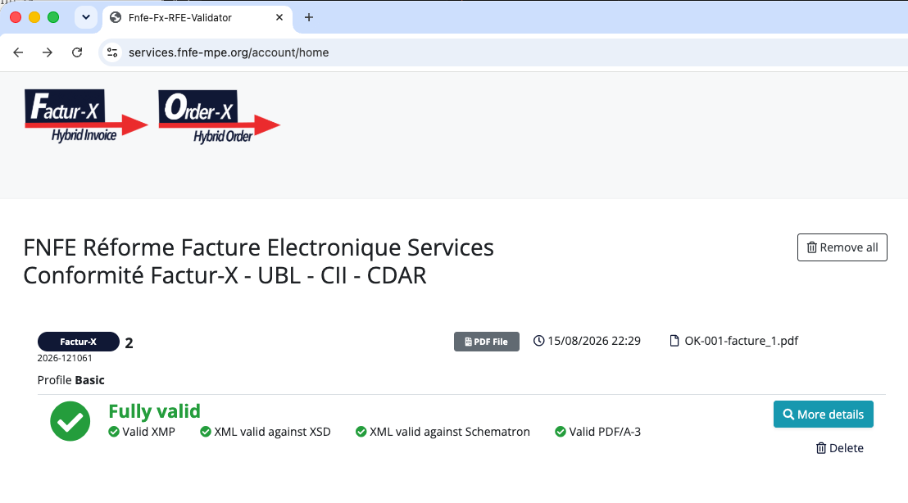

# Corpus de cas limites Factur-X

32 factures Factur-X portant chacune un défaut documenté, avec l'assertion
normative réellement déclenchée et le comportement attendu d'un validateur,
pour éprouver une implémentation.

## Démarrage

```bash
pip install -r requirements.txt      # reportlab, pikepdf
python3 corpus_facturx.py list       # catalogue des 32 cas
python3 corpus_facturx.py generate   # écrit dans ./cas
```

Chaque cas produit un dossier :

```
cas/CALC-001/
  facture.pdf     document complet, XML embarqué
  factur-x.xml    XML seul, pour tester le validateur sans passer par l'extraction
  README.md       le défaut, l'assertion déclenchée, pourquoi une implémentation le rate
cas/manifeste.json  récapitulatif exploitable par machine
```

Par où commencer : générer, puis passer `cas/OK-001/facture.pdf` à votre
implémentation. Si le témoin est refusé, inutile d'aller plus loin — le
problème est en amont des cas défectueux. Ensuite, le groupe **non normé**
ci-dessous : c'est celui qui révèle les désaccords entre implémentations
également conformes.

Les documents sont fictifs et sans valeur légale.

## Le témoin OK-001

`cas/OK-001/` est une facture Factur-X profil BASIC, conforme EN 16931 et au
profil français. Elle a été passée aux validateurs officiels — les XSLT
compilés publiés par les mainteneurs des deux jeux de règles, exécutés sous
Saxon-HE 13 :

| Jeu de règles | Version | Règles évaluées | Échecs |
|---|---|---|---|
| EN 16931 (CII) | ConnectingEurope `validation-1.3.16` | 91 | **0** |
| BR-FR (profil français) | FNFE-MPE `v1.4.0.03` du 04/08/2026 | 69 | **0** |

Empreinte du XML validé :
`sha256 bc935ffb6a960776f1d8957a6368d078853ad6d4f81ae7451fafb65562ee106b`

La génération est déterministe : le XML est reproductible à l'octet. Seuls
`CreationDate`, `ModDate` et `/ID` du PDF varient d'une exécution à l'autre.

<!-- EMPLACEMENT CAPTURE D'ÉCRAN — validateur FNFE-MPE (services.fnfe-mpe.org).
     Déposer l'image dans docs/ puis décommenter la ligne ci-dessous :

     Ce bloc est un commentaire : le README reste publiable en l'état. -->

**Limite du PDF.** La conformité PDF/A-3 est produite de façon approchée : le
profil ICC n'est pas embarqué et les polices ne sont pas intégralement
souscrites. Le corpus est fiable pour éprouver l'extraction et la validation
du XML ; il ne certifie pas une conformité PDF/A-3. Les cas concernés portent
le drapeau `pdfa_approximatif` dans le manifeste.

## Les 32 cas, groupés par ce qu'ils testent

Le groupement suit ce que chaque document déclenche réellement, mesuré, et
non la famille dont le cas vient.

Les références (`OK-001`, `CALC-001`…) sont des **identifiants du corpus, pas
des codes de norme**. Elles ont changé une fois, avant la première
publication, parce que les préfixes d'origine (`BR-`, `FMT-`, `ID-`) se
lisaient comme des codes normatifs : `BR-001` n'a jamais désigné la règle
EN 16931 `BR-1`. La table de correspondance figure en fin de document. Elles
sont désormais stables.

### Non normé — aucune assertion ne se déclenche (5 cas)

Le cœur du corpus. Ces documents passent la validation normative : aucune
assertion EN 16931 ni BR-FR ne les rejette. Deux implémentations également
conformes peuvent malgré tout les traiter différemment — l'une accepte,
l'autre refuse, et le flux bloque sans qu'aucune des deux n'ait tort.

C'est ce qu'un corpus apporte qu'un validateur ne donne pas : la liste
explicite de ce qui doit être tranché entre partenaires, puisque la norme ne
le tranche pas.

| Réf | Cas | Attendu | Ce qui diverge |
|---|---|---|---|
| `IDENT-001` | SIRET à 13 chiffres dans le visuel PDF | acceptation | Le défaut n'existe que dans le visuel ; le XML est celui du témoin à l'octet près. Croiser le lisible et le structuré n'est imposé nulle part. |
| `IDENT-002` | Clé de TVA intracommunautaire fausse | avertissement | `BR-CO-09` ne vérifie que le préfixe pays ISO 3166-1, correct ici. Aucun schematron ne recalcule la clé française modulo 97. |
| `PDF-004` | AFRelationship `/Source` au lieu de `/Data` | avertissement | La valeur attendue a varié selon les versions de la spécification (ZUGFeRD 2.0 : `/Alternative`). Toléré par la plupart des lecteurs, signalé par les validateurs stricts. |
| `PRF-001` | Profil MINIMUM avec contenu BASIC | avertissement | Document plus riche que déclaré. Rejeter ou accepter ? Aucune assertion ne compare le contenu au profil déclaré. |
| `RBT-001` | Désignation de 1 000 caractères | acceptation | Aucune limite de longueur dans les schematrons. Une troncature silencieuse en base est un défaut grave et invisible. |

### Déclenche une assertion officielle (13 cas)

Un validateur conforme doit les rejeter **et nommer la règle**. L'assertion
indiquée est celle réellement obtenue à l'exécution ; son libellé officiel
figure dans la fiche du cas.

| Réf | Cas | Attendu | Assertions déclenchées |
|---|---|---|---|
| `CALC-001` | Total TTC ≠ HT + TVA | rejet | `BR-CO-15`, puis `BR-CO-16` |
| `CALC-002` | Somme des lignes ≠ total des lignes | rejet | `BR-CO-10`, puis `BR-CO-13` |
| `CALC-003` | Ventilation TVA ≠ total TVA | rejet | `BR-CO-14`, puis `BR-CO-16` |
| `CALC-004` | Arrondi au demi-centime | rejet | `BR-DEC-23`, `BR-FR-DEC-01_BT-131`, `BR-S-08` |
| `CALC-005` | Même taux, deux écritures (`20` et `20.00`) | rejet | `BR-S-08` (deux fois) |
| `CALC-006` | Exonération sans motif déclaré | rejet | `BR-E-10` |
| `DATA-001` | Date en ISO au lieu du format 102 | rejet | `BR-FR-03_BT-2`, `CII-DT-097` |
| `DATA-002` | Date inexistante (30 février) | rejet | `BR-FR-03_BT-2` |
| `DATA-003` | Échéance antérieure à l'émission | rejet | `BR-FR-CO-07_BT-9` |
| `DATA-004` | Devise absente | rejet | `BR-05` |
| `DATA-006` | Prix net négatif sur une ligne | rejet | `BR-27`, `BR-FR-DEC-03_BT-146` |
| `IDENT-003` | Vendeur sans identifiant TVA (lignes taxées) | rejet | `BR-S-02` |
| `XML-004` | GuidelineID absent | rejet | `BR-01` |

Deux de ces cas ne se déclenchent **que** côté français — `DATA-002` (date
inexistante) et `DATA-003` (échéance antérieure) : une implémentation qui ne
charge que le schematron européen les accepte sans broncher. Trois autres
(`CALC-004`, `DATA-001`, `DATA-006`) ajoutent une assertion française à une
assertion européenne. Les deux jeux de règles doivent tourner.

### Échoue en amont du schematron (5 cas)

Document mal formé ou hors schéma XSD : aucun schematron ne s'exécute. Le
rejet doit être explicite sur la cause — un message de parseur brut n'est pas
exploitable par l'émetteur.

| Réf | Cas | Attendu | Référence |
|---|---|---|---|
| `XML-001` | XML tronqué | rejet | W3C XML 1.0 — document bien formé |
| `XML-002` | Espace de noms `rsm` erroné (`:90`) | rejet | UN/CEFACT CII — espace de noms `:100` (XSD) |
| `XML-003` | Déclaration d'encodage mensongère | rejet | W3C XML 1.0 §4.3.3 |
| `DATA-005` | Séparateur décimal virgule | rejet | XSD UN/CEFACT CII — `xs:decimal` |
| `RBT-002` | Caractères spéciaux et entités XML | rejet | W3C XML 1.0 §2.4 — échappement |

Trois de ces documents seulement sont mal formés au sens XML — `XML-001`,
`XML-003`, `RBT-002` — et aucun parseur ne va plus loin. Les deux autres sont
bien formés et échouent à la validation XSD, ce qui se voit à l'exécution :

- `XML-002` : exécuter le schematron en sautant la validation XSD produit
  trois erreurs qui désignent autre chose (`BR-CO-18` « aucune ventilation de
  TVA », `BR-S-08`, `CII-DT-033`). Les éléments `ram:` continuent en effet de
  correspondre, seule la racine `rsm:` ne correspond plus. L'émetteur corrige
  alors des montants qui n'ont rien à se reprocher.
- `DATA-005` : le XSLT EN 16931 s'interrompt sur une erreur de typage
  (`FORG0001`, `2400,00` non convertible en `xs:decimal`) sans produire de
  rapport exploitable, tandis que le schematron français signale proprement
  `BR-FR-DEC-01`. Deux validateurs, deux qualités de diagnostic sur le même
  document.

Ces deux cas mesurent la même chose : ce que coûte de sauter la validation
XSD que la double validation XSD + schematron prévoit.

### Conteneur PDF/A-3 ou spécification Factur-X (8 cas)

Le XML embarqué est valide ; c'est le conteneur ou la cohérence PDF/XML qui
est en défaut. Aucune assertion de schematron ne porte sur ces points.

| Réf | Cas | Attendu | Référence |
|---|---|---|---|
| `PDF-001` | Aucun XML embarqué | rejet | Factur-X 1.0.07 |
| `PDF-002` | Pièce jointe nommée `facture.xml` | rejet | Factur-X 1.0.07 — nom `factur-x.xml` |
| `PDF-003` | AFRelationship absent | rejet | ISO 19005-3 (PDF/A-3) |
| `PDF-005` | Métadonnées XMP Factur-X absentes | rejet | Factur-X 1.0.07 — extension XMP |
| `PDF-006` | XMP déclare un profil différent du XML | rejet | Factur-X 1.0.07 — cohérence XMP / GuidelineID |
| `PDF-007` | Pas de PDF/A (OutputIntent absent) | rejet | ISO 19005-3 |
| `PDF-008` | Entrée `/AF` absente à la racine | rejet | Factur-X 1.0.07, appuyé sur ISO 32000-2 |
| `PRF-002` | Profil inexistant | rejet | Factur-X 1.0.07 / XP Z12-012 — liste fermée |

## Ce que ce corpus a corrigé

Ce corpus a d'abord été écrit de mémoire, en attribuant à chaque cas la règle
qui semblait évidente. La vérification a établi que **huit cas ne testaient
pas ce qu'ils annonçaient**.

Elle s'est faite en deux passes, et la seconde a compté. Lire les schematrons
officiels en a corrigé six. **Exécuter** ensuite les validateurs sur les 32
documents en a rectifié trois de plus — dont deux que la lecture venait
justement de classer « aucune assertion ne se déclenche ».

Lire une règle et l'exécuter ne donnent pas le même résultat. C'est la leçon
la plus utile de ce corpus, et elle vaut pour qui l'utilise.

### Les trois cas découverts à l'exécution

**`CALC-005` — même taux écrit `20.00` puis `20`.**
Ce qu'on croyait : aucune assertion ne se déclenche. `BR-CO-17` tient
effectivement — chaque ventilation est arithmétiquement juste — et `BR-CO-14`
aussi. Le cas était classé comme une divergence d'implémentation.
Ce qui se passe : **`BR-S-08` se déclenche, deux fois.** La comparaison des
taux y est numérique : `20` et `20.00` sont le même taux. Chaque ventilation
déclare donc une base (2 400,00 puis 135,00) qui ne vaut pas la somme des
lignes à ce taux (2 535,00). Le validateur signale des bases de TVA fausses
alors que la cause est un regroupement raté — chercher l'erreur dans les
montants fait perdre des heures.

**`DATA-003` — échéance antérieure à la date de facture.**
Ce qu'on croyait : aucune règle ne l'interdit, c'est une erreur de saisie à
signaler sans rejeter.
Ce qui se passe : vrai côté européen, **faux côté français**.
`BR-FR-CO-07_BT-9` exige une échéance postérieure ou égale à la date de
facture, sauf facture d'acompte (386, 500, 503) ou cadre de facturation B2,
S2 ou M2. Le cas est un rejet.

**`XML-002` — espace de noms `rsm` erroné.**
Ce qu'on croyait : le document est hors schéma, donc aucun contexte de
schematron ne correspond plus.
Ce qui se passe : les éléments `ram:` correspondent toujours, seule la racine
`rsm:` ne correspond plus. Le schematron produit **trois erreurs qui
désignent autre chose** : `BR-CO-18` (« aucune ventilation de TVA »),
`BR-S-08`, `CII-DT-033`. Le cas en devient plus instructif : il montre ce que
coûte de sauter la validation XSD.

### Les cinq autres, corrigés à la lecture des règles

| Réf | Ce qui était annoncé | Ce qui a été établi |
|---|---|---|
| `IDENT-001` | « SIRET à 13 chiffres », violation de `BR-CO-26`, rejet | Le SIRET tronqué n'atteint jamais le XML : il n'existe que dans le visuel PDF. Le XML est celui du témoin à l'octet près. Un validateur conforme accepte. Attendu corrigé en acceptation. |
| `IDENT-002` | Clé de TVA fausse, violation de `BR-CO-09`, rejet | `BR-CO-09` ne vérifie que le préfixe pays. Aucun schematron ne recalcule la clé française. Attendu corrigé en avertissement. |
| `IDENT-003` | « Vendeur sans aucun identifiant », violation de `BR-CO-26` | L'identifiant légal (SIREN, schemeID 0002) reste présent : `BR-CO-26`, qui exige au moins un identifiant parmi trois, tient. C'est `BR-S-02` qui se déclenche — TVA facturée sans identifiant TVA du vendeur. |
| `DATA-006` | « Ligne à montant négatif », violation de la distinction TypeCode 380 / 381 | Un montant de ligne négatif (BT-131) est licite en EN 16931, y compris sur une facture 380 : c'est ainsi qu'on porte une remise en ligne. C'est le **prix** net négatif que `BR-27` interdit. |
| `PDF-008` | Entrée `/AF` absente, violation de PDF/A-3 §3.1 | PDF/A-3 n'exige pas le tableau `/AF` du catalogue. L'exigence vient de la spécification Factur-X, appuyée sur les fichiers associés d'ISO 32000-2. |

Trois autres cas portaient un code faux sans se tromper sur la nature du
défaut : `DATA-001` et `DATA-002` citaient `BR-02` — qui concerne le numéro
de facture, pas la date — alors que le contrôle du format et du calendrier
vient du schematron français `BR-FR-03_BT-2` ; `CALC-004` citait la famille
`BR-DEC-*` au lieu de l'assertion précise `BR-DEC-23`.

## Reproduire la vérification

Les deux jeux de règles publient leurs schematrons **et** leurs XSLT
compilés. Ces derniers s'exécutent hors ligne avec SaxonC-HE (XSLT 2.0) :
`lxml` ne suffit pas, il s'arrête à XSLT 1.0.

```bash
pip install saxonche

curl -L -o en16931.xslt \
  https://raw.githubusercontent.com/ConnectingEurope/eInvoicing-EN16931/validation-1.3.16/cii/xslt/EN16931-CII-validation.xslt
curl -L -o brfr.xslt \
  https://raw.githubusercontent.com/fnfempe/France_RFE/v1.4.0.03/FNFE_RFE_INVOICE/Factur-X/EN16931/2xslt/BR-FR-Flux2-Schematron-CII.xslt
```

```python
import re
from saxonche import PySaxonProcessor

with PySaxonProcessor(license=False) as proc:
    xsl = proc.new_xslt30_processor()
    for validateur in ("en16931.xslt", "brfr.xslt"):
        svrl = xsl.compile_stylesheet(stylesheet_file=validateur) \
                  .transform_to_string(source_file="cas/OK-001/factur-x.xml")
        evaluees = len(re.findall(r"<svrl:fired-rule", svrl))
        echecs = re.findall(r"<svrl:failed-assert.*?</svrl:failed-assert>",
                            svrl, re.S)
        print(f"{validateur}: {evaluees} règles évaluées, {len(echecs)} échec(s)")
        for e in echecs:
            texte = re.search(r"<svrl:text>(.*?)</svrl:text>", e, re.S)
            print("  ", re.sub(r"\s+", " ", texte.group(1)).strip())
```

Sur `cas/OK-001/factur-x.xml`, la sortie attendue est `91 règles évaluées, 0
échec(s)` puis `69 règles évaluées, 0 échec(s)`.

La même boucle sur les 32 cas reproduit le groupement du tableau ci-dessus.
Prévoyez le cas d'un document que le validateur ne peut pas traiter :
`XML-001`, `XML-003` et `RBT-002` ne sont pas bien formés et lèvent une
exception de parsing ; `DATA-005` fait échouer le XSLT EN 16931 sur une
erreur de typage. C'est le résultat attendu.

La validation est entièrement locale : aucun document n'est transmis à un
tiers.

## Usage

Ces fichiers sont destinés à éprouver votre propre implémentation, ou une
implémentation publique et librement accessible.

**Ne les soumettez pas au système de production d'un tiers sans y avoir été
invité par écrit.** Ce sont des documents volontairement défectueux ; les
envoyer à une plateforme de réception réelle produit du bruit d'exploitation
chez quelqu'un qui ne l'a pas demandé.

Ce qu'on attend d'un rejet, et ce que le corpus mesure vraiment : un rejet
doit nommer la règle violée et le champ concerné. « Ce fichier n'a pas pu
être traité » n'est pas exploitable par l'émetteur — c'est ce défaut-là que
les fiches de cas cherchent à mettre en évidence.

## Sources et versions

Vérifié le 16/08/2026 contre :

| Jeu de règles | Source | Version | Fichier | Empreinte SHA-256 |
|---|---|---|---|---|
| EN 16931 (CII) | [ConnectingEurope/eInvoicing-EN16931](https://github.com/ConnectingEurope/eInvoicing-EN16931) | `validation-1.3.16` | `cii/schematron/preprocessed/EN16931-CII-validation-preprocessed.sch` | `54e0dc6d06cd7f17d268bb9696ff56f58d386ee28961c9bbef0a56718c400c89` |
| BR-FR (profil français) | [fnfempe/France_RFE](https://github.com/fnfempe/France_RFE) | `v1.4.0.03` du 04/08/2026 | `FNFE_RFE_INVOICE/CII/EN16931/schematron/BR-FR-Flux2-Schematron-CII.sch` (V1.4.0 du 30/06/2026) | `d1172c6e89cc17fcdafcaaaf2ad57c2d1d1a576ad7694b5a6e5514a7cec0c4db` |

Les schematrons BR-FR sont publiés par la FNFE-MPE en application de la norme
expérimentale AFNOR **XP Z12-012**. La norme elle-même est diffusée par
l'AFNOR et n'a pas été consultée : la correspondance établie ici vaut pour sa
traduction machine officielle, dans la version citée.

Syntaxe CII uniquement — celle de Factur-X. Les schematrons UBL des mêmes
releases n'ont pas été confrontés. Le schematron BR-FR `_WARNING` (mêmes
règles en sévérité avertissement) et les règles de cycle de vie (BR-FR-CDV,
CDAR) sont hors périmètre.

Exécution sous SaxonC-HE 13 (XSLT 2.0), via les XSLT compilés publiés dans
ces mêmes releases.

### Renumérotation des références

Changement unique, effectué avant la première publication.

| Ancienne réf | Nouvelle réf |
|---|---|
| `BR-001` … `BR-006` | `CALC-001` … `CALC-006` |
| `FMT-001` … `FMT-006` | `DATA-001` … `DATA-006` |
| `ID-001` … `ID-003` | `IDENT-001` … `IDENT-003` |

La numérotation à l'intérieur de chaque famille est conservée :
`BR-005` devient `CALC-005`, `FMT-002` devient `DATA-002`.

`OK-001`, `PDF-00x`, `XML-00x`, `PRF-00x` et `RBT-00x` sont inchangés : aucune
ambiguïté possible avec un code normatif.

## Licence

MIT. Les documents générés sont fictifs et sans valeur légale ; toute
ressemblance avec des entreprises existantes serait fortuite.
